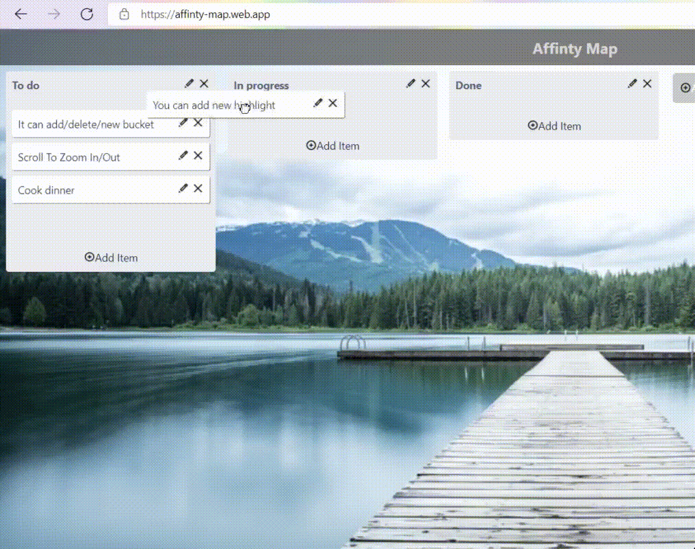
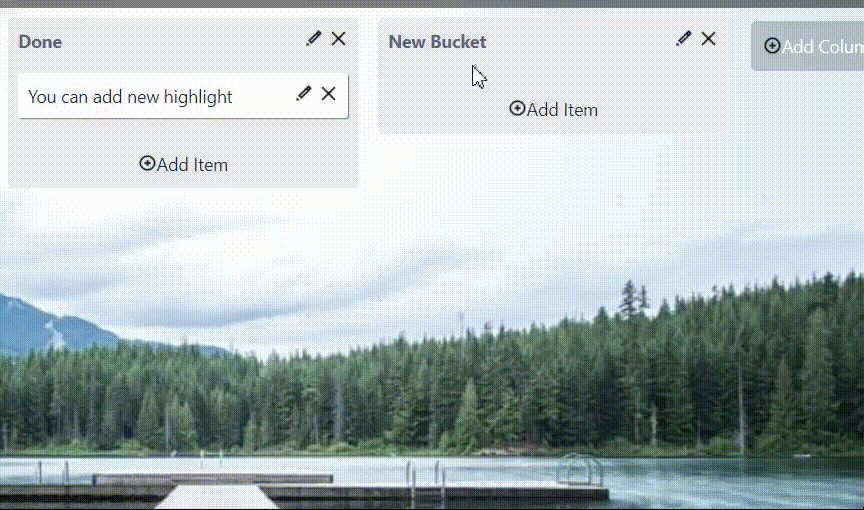

# Affinity Map - Dipit Sharma 2K19/CO/127 📋 

#### If you still have quesries about the code, please free to contact me. This project was made in a few amount of time it may lack some efficiency 👍

## Features:

    - Add/Delet/Edit Highlights 
    - Group/Move Highlights
    - Add/Delet/Edit Buckets
    - Zoom In/Out Affinity Map 

### Add Highlights

### Add Bucket

### Pan And Zoom

## Folder Architecture (src) :

    - components ( contains buckets, highlights rendering coponents )
        - column.js
        - tasks.js

    - pages ( contains main - home page, and zoom page)
        - home.js
        - zoom.js

    - database ( contains database functions to store and save data, so that state is saved after refresh )
        - update.js
    
    - data ( contains initial data )

## To set Up On Local Machine:

    - git clone https://github.com/superstark02/affiliate-map.gitt
    - npm i
    - npm start

## More information
    * Hosting Link : https://affinty-map.web.app/
    * Video : https://drive.google.com/file/d/1YFMy3DLDIFezlxw42Cqgj4A9AgCiiL1L/view?usp=sharing

